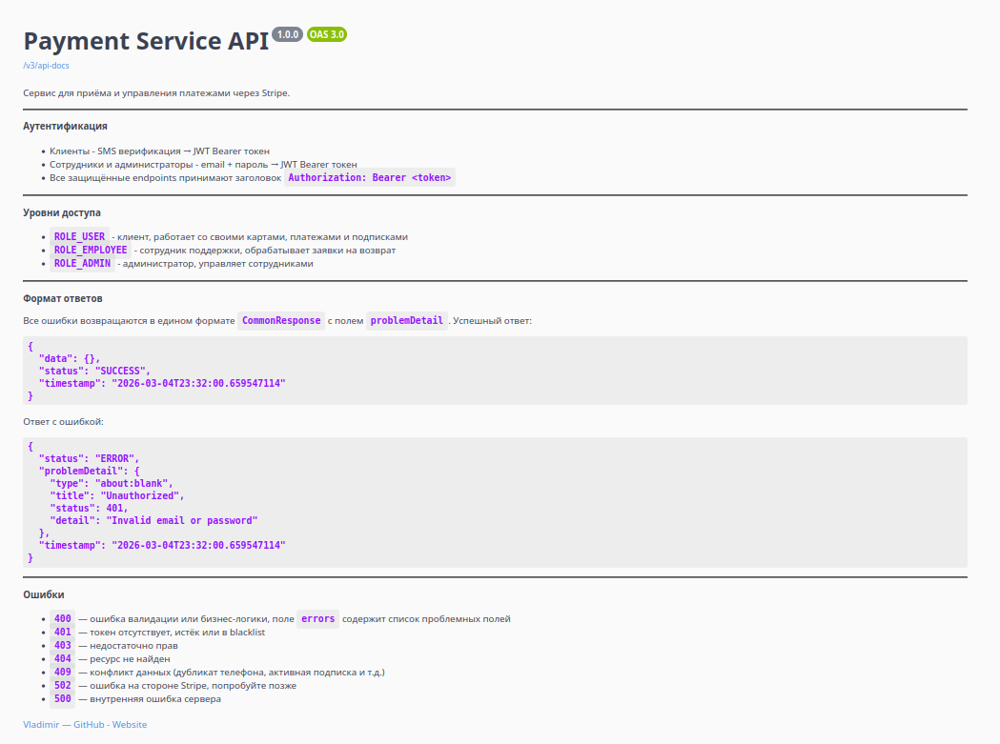
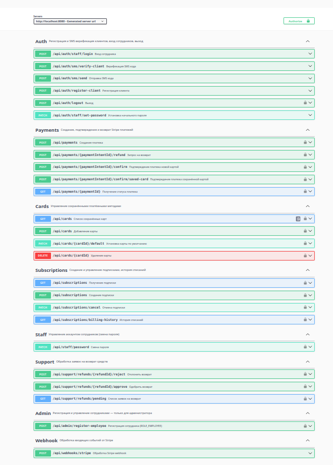

# Payment Service

Платёжный сервис с интеграцией Stripe, автоматическим биллингом подписок и двухэтапным workflow возвратов.

## Описание

Бэкенд-сервис для управления платежами, подписками и возвратами. Реализует полный цикл работы с платёжными данными: от приёма платежей через Stripe до автоматического биллинга по расписанию и обработки webhook событий.

## Технологии

- **Java 21** + **Spring Boot 3.3.5**
- **PostgreSQL 16** — основное хранилище, миграции через Flyway
- **Redis** — хранение JWT токенов (blacklist)
- **Stripe API** — приём платежей, управление картами, webhook события
- **Spring Security** — раздельная аутентификация для клиентов и сотрудников
- **Swagger / OpenAPI 3.0** — подробная документация API: каждый endpoint покрыт описанием request/response моделей, кодов ответов и примеров через `@Schema`, `@Operation`, `@ApiResponse`

## Ключевые возможности

**Платежи и подписки**
- Приём платежей через Stripe PaymentIntent API
- PCI DSS совместимая токенизация карт через Stripe Customer и SavedCard
- Подписки с автоматическим биллингом по расписанию (Spring Scheduler)
- Retry логика при неудачных списаниях
- Статусная машина подписок: `PAST_DUE` → `PROCESSING` → `ACTIVE` / `SUSPENDED` / `CANCELLED`

**Webhook обработка**
- Идемпотентная обработка Stripe webhook событий
- Strategy pattern для обработчиков событий (`payment_intent.succeeded`, `payment_intent.payment_failed`, `charge.refunded` и др.)
- Верификация подписи Stripe с поддержкой dev-режима

**Возвраты**
- Двухэтапный workflow: клиент создаёт запрос → сотрудник одобряет или отклоняет
- Интеграция с Stripe Refund API
- Обработка финального статуса через webhook (`refund.succeeded`, `refund.failed`)

**Аутентификация**
- Клиенты — JWT аутентификация через SMS код, HttpOnly cookies, blacklist токенов в Redis
- Сотрудники (Employee) — первичный пароль генерируется при создании аккаунта, email/password аутентификация
- Ролевая модель: `ROLE_USER`, `ROLE_EMPLOYEE`, `ROLE_ADMIN`

## Тестирование

Сервисный слой покрыт Unit и интеграционными тестами. JaCoCo собирает объединённый отчёт покрытия.

- **Unit тесты** — Mockito, запускаются через Maven Surefire
- **Интеграционные тесты** — Testcontainers (PostgreSQL) + WireMock для Stripe API, запускаются через Maven Failsafe

```bash
./mvnw verify # все тесты + отчёт покрытия
```
Отчёт генерируется в `target/site/jacoco-merged/`.

## Быстрый старт

```bash
git clone https://github.com/Vldr22/payment-service.git
cd payment-service
cp .env.example .env  # заполнить переменные окружения
./mvnw spring-boot:run
```

**Swagger UI:** http://localhost:8080/swagger-ui/index.html

## API Documentation




## Roadmap

- [ ] Docker Compose
- [ ] Расширенное управление для администратора: фильтрация платежей, подписок, пользователей
- [ ] Email уведомления о статусе платежей и подписок
- [ ] Prometheus + Grafana мониторинг метрик платежей
- [ ] Полнотекстовый поиск и аналитика по платежам
